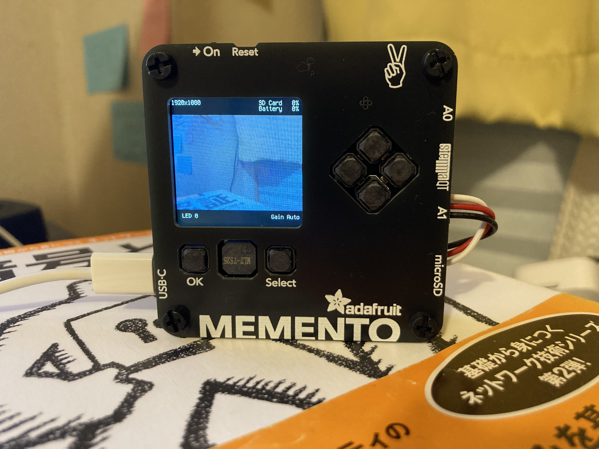

# べーこんかめら CircuitPython版

## 動かしかた

1. MEMENTOをUSBでつなぐ
2. MEMENTOにCircuitPython 9をインストールする
   - [インストール手順](https://learn.adafruit.com/adafruit-memento-camera-board/install-circuitpython)
   - `CIRCUITPY`ドライブが認識されたらインストール完了
3. `./deploy.sh` を実行する
   
## 操作方法

- [ボタン名称](#ボタン名称) 
- [撮影方法](#撮影方法) 
- [画像プレビュー](#画像プレビュー) 

## ボタン名称

- 電源ボタン
- リセットボタン
  - 不具合が起きたらこのボタンを押して再起動する
- シャッターボタン
- 操作ボタン
- OKボタン
- セレクトボタン

## 撮影方法

1. 電源を入れる
2. シャッターを押す

※シャッター長押しでオートフォーカスされる
※撮影時はわずかに"ジジ"という音がなるように設定してある

## 画像プレビュー

1. 初期画面からセレクトボタンを押す
2. 操作ボタンの左右で画像が１枚ずつ送られる
